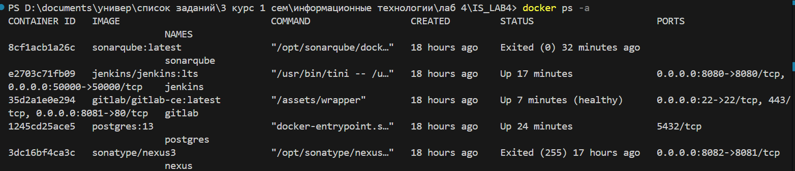

# Laba 4
Автор - Криворучко Павел

### Лабораторная работа №4

# **Задача 1. Подготовка окружения**  

## скриншоты работающих сервисов

# **Задача 2. Создание Python-приложения**  
## Создание файла `text_tool.py` с функционалом:

## Файл с модульными тестами  `test_text_tool.py`:  

## файл `requirements.txt` с зависимостями:

## репозиторий GitLab:[git-lab](https://gitlab.com/feed999/test)

# **Задача 3. Интеграция инструментов**  

## Настройка `.gitlab-ci.yml`:
- файл [.gitlab-ci.yml](https://gitlab.com/feed999/test/-/blob/main/.gitlab-ci.yml?ref_type=heads)

## Настройка Jenkins Pipeline:
- файл [Jenkinsfile](https://gitlab.com/feed999/test/-/blob/main/Jenkinsfile?ref_type=heads)

## Кол-во попыток:  

## Консольный вывод сборки Jenkinsfile:  

# **Задача 4. Анализ кода с SonarQube**  
## Консольный вывод сборки Jenkinsfile с SonarQube для анализа Python-кода:

## Кол-во попыток:  

## Итог сборки в SonarQube:  

