# Laba 4
Автор - Криворучко Павел

### Лабораторная работа №4

# **Задача 1. Подготовка окружения**  
- файл [docker-compose.yaml](https://github.com/Pavlushechko/IS_lab4/blob/main/docker-compose.yaml)

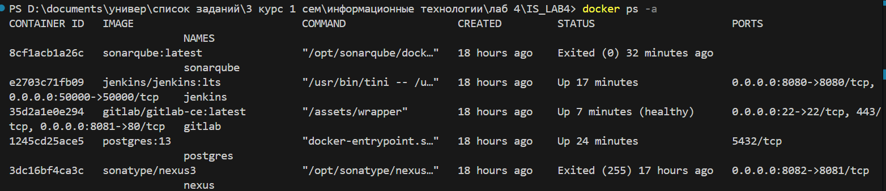

# **Задача 2. Создание Python-приложения**  

## репозиторий GitLab:[git-lab](https://gitlab.com/pavlushechkos/IS_LAB4)

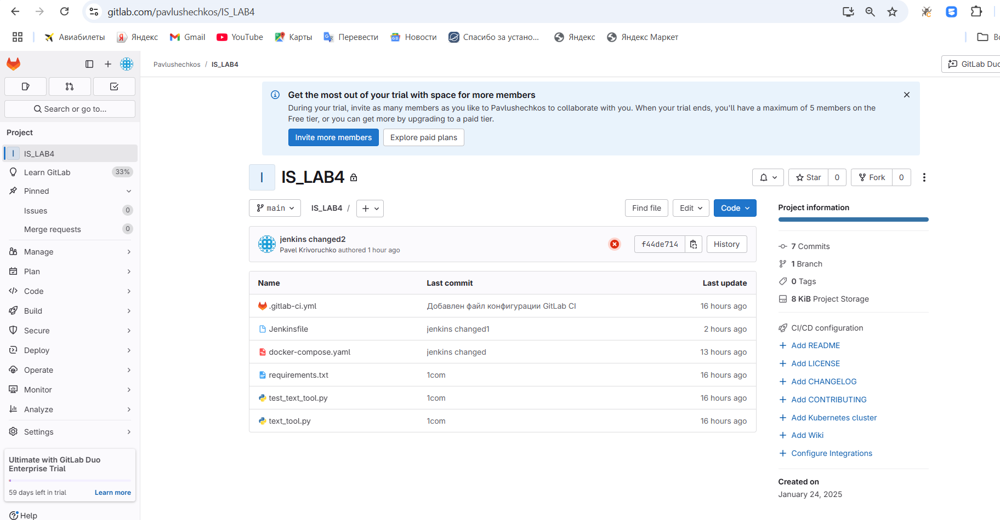

# **Задача 3. Интеграция инструментов**  

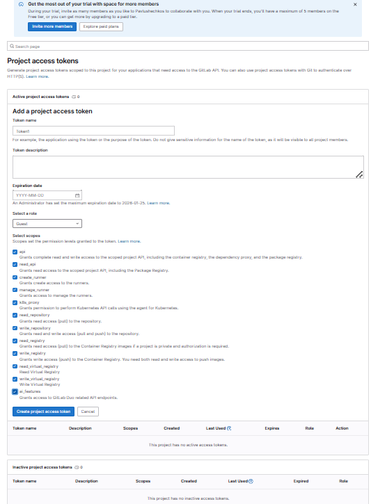

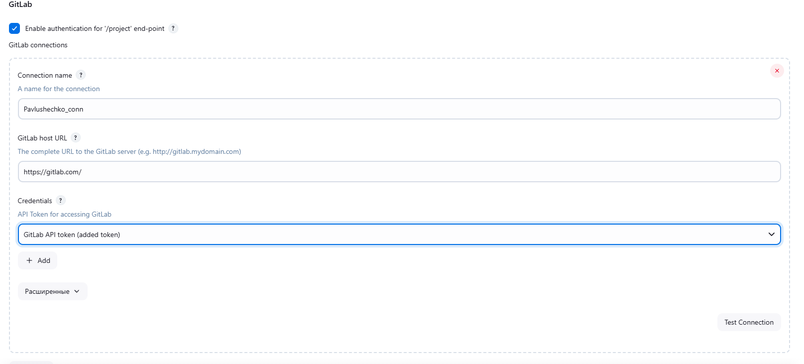

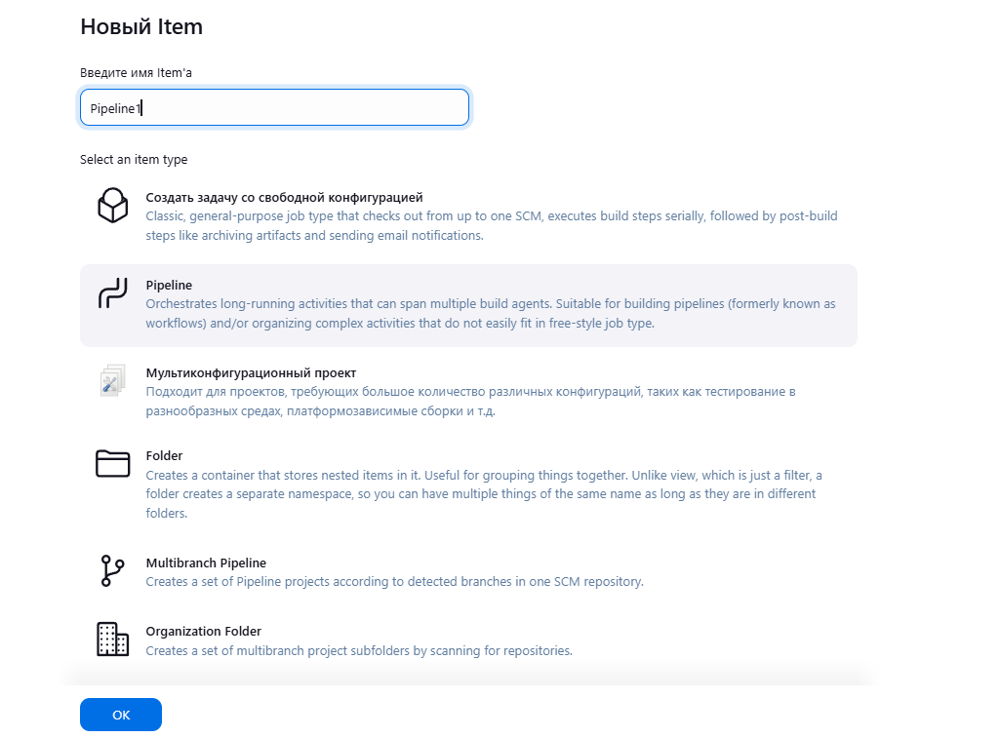

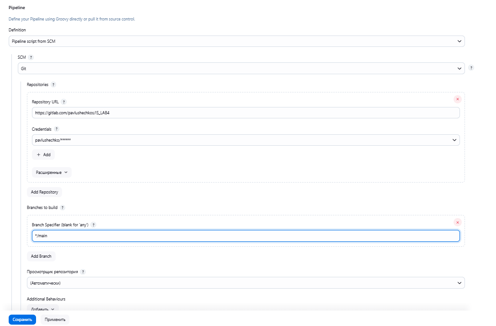

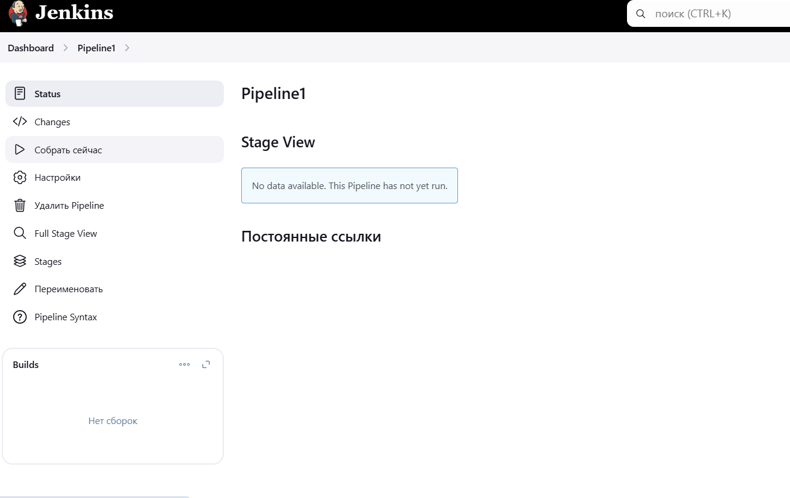

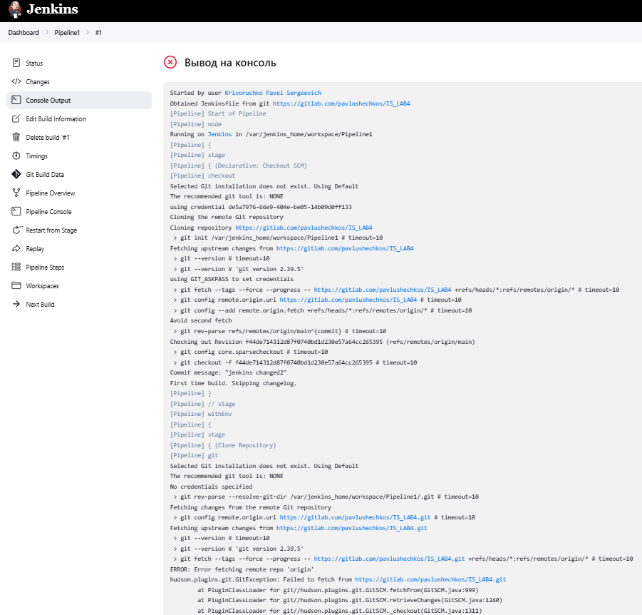

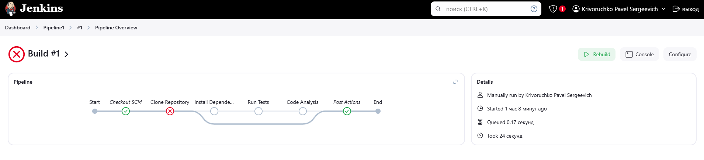

# **Задача 4. Анализ кода с SonarQube**  

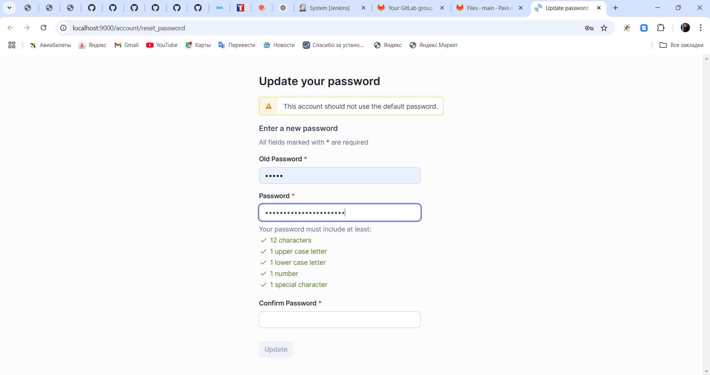

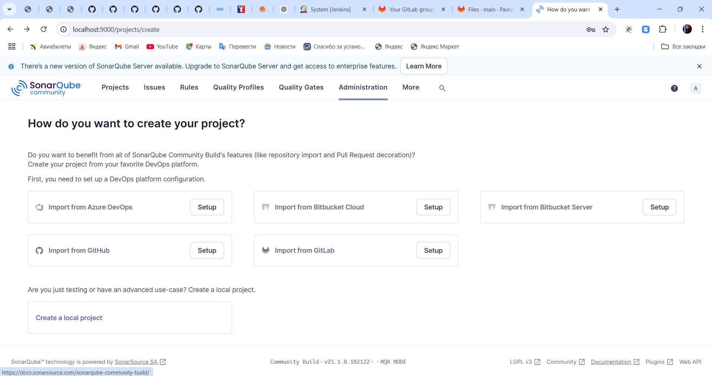

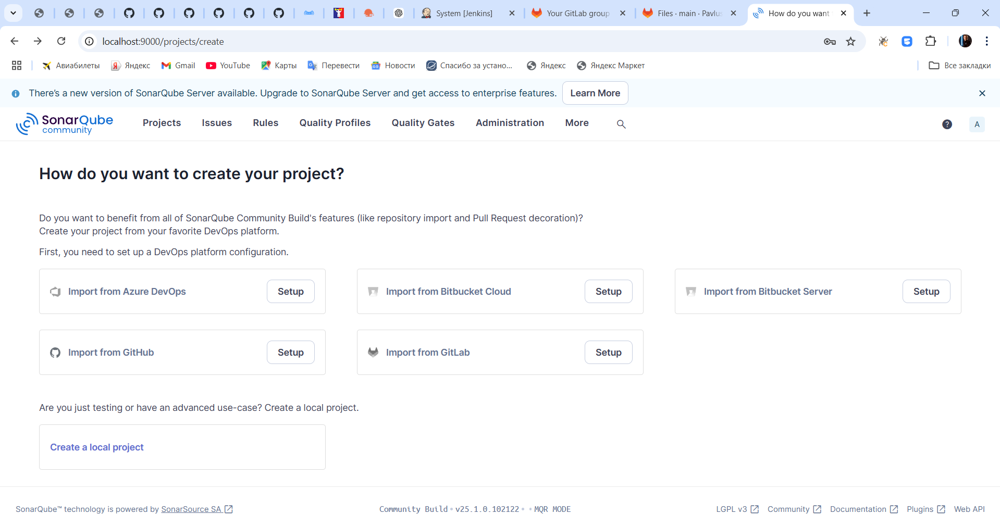

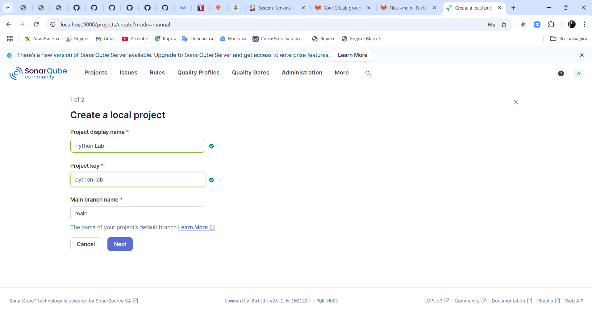

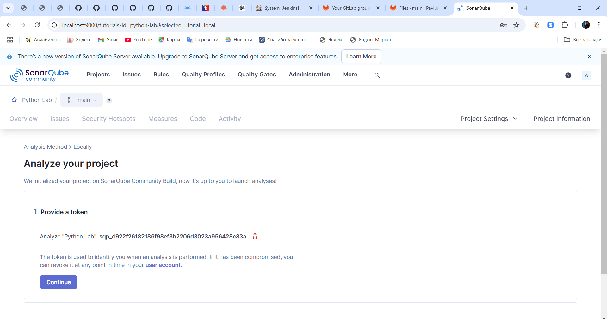

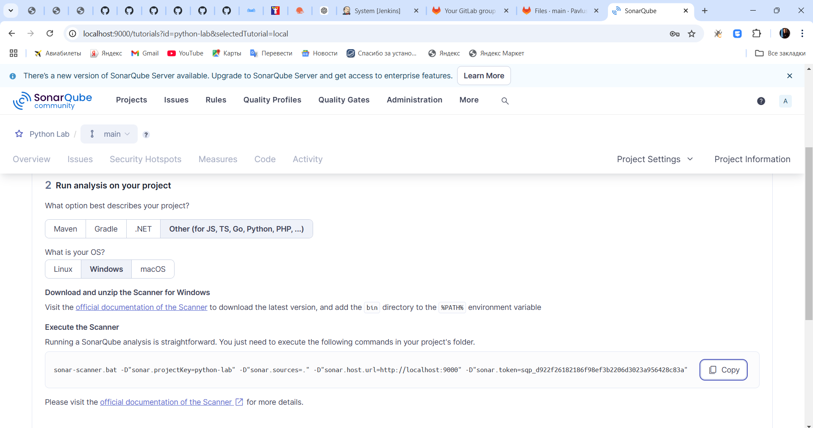
